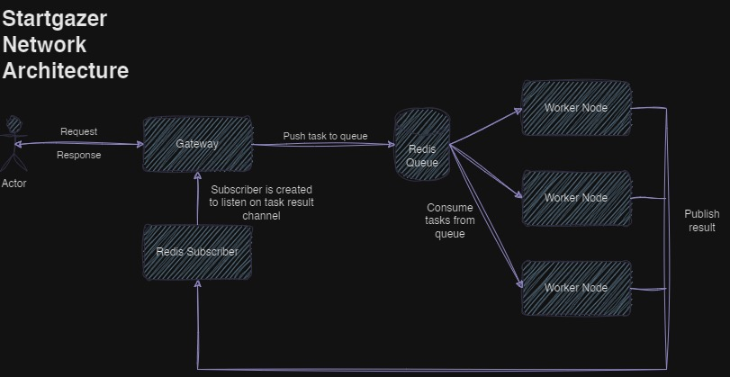

# Stargazer Network: Gateway

## Table of Contents

-   [Stargazer Network: Gateway](#stargazer-network-gateway)
    -   [Table of Contents](#table-of-contents)
    -   [Overview](#overview)
    -   [Features](#features)
    -   [Architecture](#architecture)
    -   [How It Works](#how-it-works)
    -   [Getting Started](#getting-started)
        -   [Prerequisites](#prerequisites)
        -   [Installation](#installation)
        -   [Configuration](#configuration)
        -   [Running the Gateway](#running-the-gateway)
    -   [API Endpoints](#api-endpoints)
    -   [Scaling and Performance](#scaling-and-performance)
    -   [Future Enhancements](#future-enhancements)
    -   [Contributing](#contributing)
    -   [License](#license)

## Overview

Stargazer Network Gateway is an advanced wrapper for the Ollama / OpenAI API standard, implementing a master-worker paradigm for efficient request processing. This gateway acts as a sophisticated load balancer, distributing tasks across multiple worker nodes to enhance performance and scalability.

## Features

-   Master-worker architecture for distributed processing
-   Redis-based queue system for efficient load balancing
-   Support for streaming responses
-   Horizontal scalability for both gateway and worker nodes
-   Compatible with Ollama and OpenAI API standards

## Architecture

The Stargazer Network Gateway consists of two main components:

1. **Gateway (Master)**: Handles incoming requests and distributes them to worker nodes.
2. **Workers**: Process requests and generate responses.

Here's a high-level diagram of the system architecture:



## How It Works

1. **Request Ingestion**: The gateway receives API requests and pushes them into a Redis queue.
2. **Task Distribution**: Worker nodes consume tasks from the Redis queue.
3. **Processing**: Each worker processes the request using the Ollama/OpenAI API.
4. **Response Handling**:
    - A unique task ID is assigned to each request.
    - A Redis subscriber is created for each task ID.
    - Workers publish results to the corresponding Redis channel.
    - The gateway collects responses and streams them back to the client.
5. **Completion**: Once the response is fully processed, the API returns the result, and the Redis subscriber is closed.

This architecture ensures efficient load distribution and enables horizontal scaling of both the gateway and worker nodes.

To understand how the worker works. Please checkout the [Stargazer Network Worker](https://github.com/CptShad/SGNet-Worker) project.

## Getting Started

### Prerequisites

-   [Bun](https://bun.sh/) runtime
-   [Redis](https://redis.io/) server

### Installation

1. Clone the repository:

    ```bash
    git clone https://github.com/yourusername/SGNet-Gateway.git
    ```

2. Navigate to the project directory:

    ```bash
    cd SGNet-Gateway
    ```

3. Install dependencies:
    ```bash
    bun install
    ```

### Configuration

1. Copy the `.env.example` file to `.env`:

    ```bash
    cp .env.example .env
    ```

2. Edit the `.env` file and set the appropriate values for your environment, especially the Redis connection details.

### Running the Gateway

Start the gateway:

```bash
bun run start
```

By default, the gateway runs on `http://localhost:3000`.

## API Endpoints

The gateway exposes the following endpoints:

-   `POST /api/generate`: For text generation requests
-   `POST /api/chat`: For chat-based interactions

Refer to the API documentation for detailed request and response formats.

## Scaling and Performance

The Stargazer Network Gateway is designed for horizontal scalability:

-   Multiple gateway instances can be deployed behind a load balancer.
-   Worker nodes can be added or removed dynamically to adjust processing capacity.
-   Redis cluster can be set up for high availability and performance.

## Future Enhancements

-   Implement [Exo](https://github.com/exo-explore/exo) to support running large models more efficiently.
-   Implement model based queues and have a way to load balance based on model type. Since not all nodes will have all the models.

## Contributing

We welcome contributions! Please see our [Contributing Guidelines](./docs/CONTRIBUTING.md) for more details.

## License

This project is licensed under the [MIT License](LICENSE).
